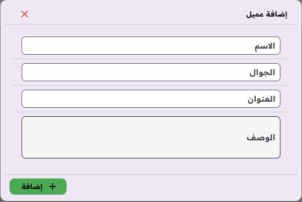

# MoAmri Accounting برنامج محاسبي 

هذا المشروع عبارة عم مشروع Flutter لنظام محاسبي باللغة العربية

A Flutter project for accounting in arabic language

## Features المميزات

1. Printing الطباعة

     الطباعة بنوعين من الورق A4 أو roll 80mm
     print in two types of papers

2. Barcode Scanner قراءة الباركود من الفاحص

## TODO list قائمة المهام

- [x] Create store إنشاء متجر

- [x] Login تسجيل دخول

- [ ] Logout or user switch تسجيل خروج أو تبديل المستخدمين
- [x] Inventory with currencies and materials, adding, editing, delete, nad printing المخزن مع العملات والمواد, إضافةو تعديل و حذف وطباعة

- [x] Customers, adding, editing, delete, nad printing العملاء, إضافة و تعديل و حذف وطباعة

- [x] Sales البيع

- [ ] Returns المرتجع

Still some work todo here 
ما زال هنالك بعض العمل هنا 
- [ ] complete the rest pages بقية الصفحات
